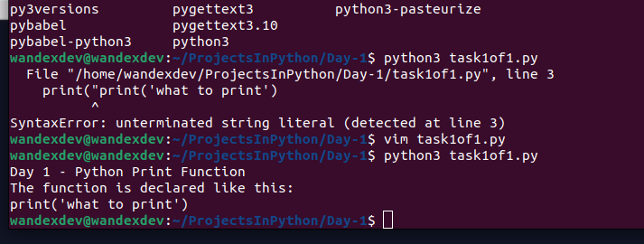
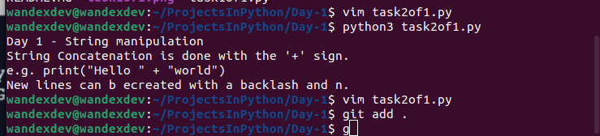
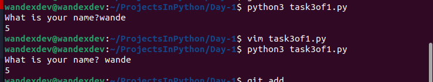

# Day 1

## Task 1

 * Printing to the console
 * appropriate print function syntax
 * sorted use of two different quotes in one line

## Task 2

 * Outputing numerous lines of strings with one `print()` function
 * Concatenating different strings using `+` 

## Task 3

 * Input function syntax
 * inserting one function in another
 * writing comments
 * counting length of string via `len()` function

---
# PROJECT 1: BAND NAME GENERATOR

 * Variables
 * Combination of all tasks 
  
