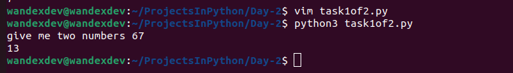
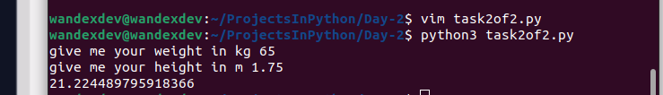

# Day 2

## Task 1

 * Subscrpting strings via `[]`
 * Idenitfy data type with `type()`
 * Convert data types i.e `int()` to `str()` to `float() and vice versa
 * Addition

## Task 2 BMI CALCULATOR

 * Arithmetric Operators:
   * `+` Addition
   * `-` Subtraction
   * ` ` Multiplication
   * `/` Division
   * `**` Exponent

## Task 3
 * Rounding up float data type to whole number with `round()` function
 * The floor operator `//` and its role in automatic conversion of division results to interger data type as opposed to floats.
 * Variable Manipulation (altering previously saved variables)
			 e.g `variable_name /= x`
			     `variable_name += x`
			     `variable_name -= x`
			     `variable_name *= x`
 * f-String: `f"string{variable}, string2{variable2}, stringn{variablen}"`
   * Prevents series of conversion to multiple data types before getting correct console outputs.
 
