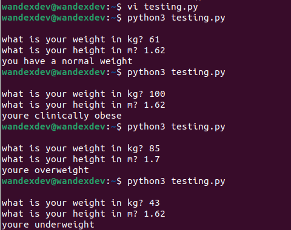
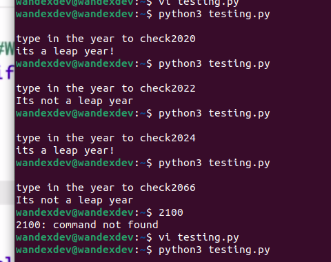
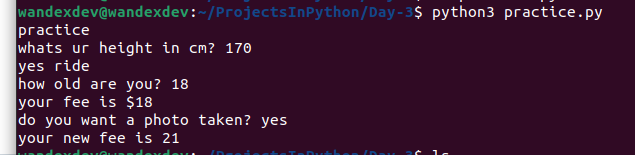

# Day 3

## Task 1

 * Used Conditional statements syntax: if/else (either a or b)
  * if whatever:
  	do this
    else:
    	do this
 * more arithmetric operators:
  * `<` is less than
  * `>` is greater than
  * `<=` is less or equal to
  * `>=` is greater or equal to
  * `==` is eqal to
  * `!=` is not equal to
  * `=` is an assignment i.e when assigning variables

## Task 2

* used modulo `(%)`. It divides though 2 given intergers and outputs the remainder. i.e the reminder of the division between the two numbers

## Task 3

* learnt nested `if/else statements` statements
* used `elif` (more like a 2nd condition, not true (if) and not false (else))
 * `elif` can  be one or more between if and else
 * when code is checked, 
   * if condition from `if' is true, it executes the exact line
   * if not, checks for `elif` and if `elif` is true, executes it
   * if not, it keeps searching and executing the next `elif` thats true
   * if no `elif`, it executes the final `else`
* used fstring and arithmetric operators from previous lessons also

## Task 4: Leap year verification

* used multiple elif

## Practice

* assigned a changing variable to each conditions if executed
* used f-string to print out final variable together with string
* used incremental `+=`

## Task 5
* more complex multiple if

## Task 6: Love Calculator
* using Logical operators to combine multiple conditional statemenrs
	* `and` ( if condition a and condition b are true)
	* `or` ( if any of conditions a or b is true)
	* `not` (reverses a condition. makes true become false and vice versa)
	* used `lower()` function to convert all upper case in a string to lower case e.g string = "PYTHON Projects"
		print(string.lower())
	=>	python projects
	* used `count()` function to count how many items are in a collection. e.g string = "The energy is high!"
		print(string.count('e'))
	=>	3
