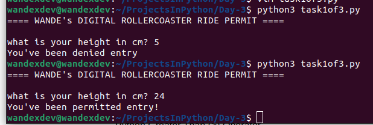

# Day 3

## Task 1

 * Used Conditional statements syntax: if/else (either a or b)
  * if whatever:
  	do this
    else:
    	do this
 * more arithmetric operators:
  * `<` is less than
  * `>` is greater than
  * `<=` is less or equal to
  * `>=` is greater or equal to
  * `==` is eqal to
  * `!=` is not equal to
  * `=` is an assignment i.e when assigning variables 
